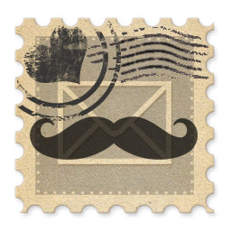

|-----------------------------------------------|-----------|-----------------------------------------------------------------------|
|                                               |           |                                                                       |
|     | Corbin:   | <host@paudeville.com>                                                 |
| | Julie:    | <hostess@paudeville.com>                                              |
|       | Twitter   | [@paudeville](https://www.twitter.com/paudeville)                     |
|     | Facebook  | [@paudeville](https://www.facebook.com/paudeville)                    |
|   | Instagram | [@paudevilleshow](https://www.instagram.com/paudevilleshow)           |
| 			| RSS       | [Feed](http://paudeville.github.io/minimal-mistakes/podcast-feed.xml) |

    

	    <a class="twitter-timeline" data-width="500" data-tweet-limit="5" href="https://twitter.com/paudeville?ref_src=twsrc%5Etfw">
		    Tweets by Paudeville
		</a>
        
    

